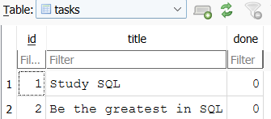

## CRUD-API: Database Integration

### Why SQLite?

This project uses **SQLite** because it is lightweight, serverless, and easy to set up. It does not require installing or configuring a separate database server, making it an excellent choice for small projects, learning SQL, and developing REST APIs with FastAPI.

### Database Location

The database is stored locally in the project root as:

```text
tasks.db
```

The application automatically creates this file on the first run if it does not already exist.

### Running the Project

1. Clone the repository.

```bash
git clone https://github.com/MochitoMacchiato/CRUD-API-DATABASE.git
cd <your-project-folder>
```

2. (Optional) Create and activate a virtual environment.

**Windows (PowerShell)**

```powershell
python -m venv .venv
.\.venv\Scripts\Activate.ps1
```

3. Install the required dependencies.

```bash
pip install -r requirements.txt
```

4. Start the FastAPI development server.

```bash
uvicorn main:app --reload
```

5. Open your browser and navigate to:

* Swagger UI: `http://localhost:8000/docs`
* ReDoc: `http://localhost:8000/redoc`

On the first launch, the application automatically:

* Creates `tasks.db` if it does not exist.
* Creates the `tasks` table if it does not exist.
* Inserts three sample tasks only if the table is empty.

No manual database setup is required.

### SQLite Database Viewer

Example:



### Example SQL Query

One of the SQL queries executed during development was:

```sql
SELECT * FROM tasks WHERE done = 1;
```

This query retrieves all tasks that have been marked as completed.

Another useful query for counting all tasks is:

```sql
SELECT COUNT(*) FROM tasks;
```

And many more, feel free to explore SQLite's documentation.